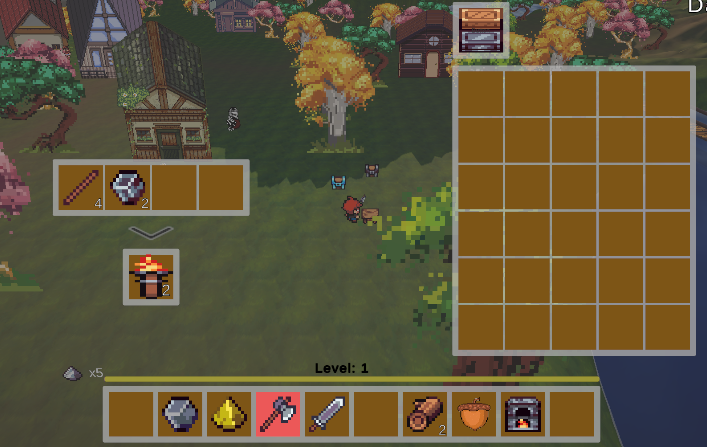

# Welcome to the 2.5D RPG Game Project

Welcome to the 2.5D RPG Game Project, a personal project focusing on adventure/survival/farming genres. This project will continuously update with exciting new features in the future.

## Table of Contents

- [Introduction](#introduction)
- [Features](#features)
- [Installation](#installation)
- [Usage](#usage)
- [Other](#other)

## Introduction

This is a personal project aimed at learning and practical application, developed since February 2024. The current project includes all basic functionalities of an adventure survival game, although not yet complete, it is playable with ongoing updates for new features.

## Features

List the main features of your game:  

- Item system: This is a game item system using Scriptable Objects to create, manage, and track items within the game. It enhances convenience for related functionalities such as inventory systems and chests.  
   
- Inventory system: This is an item management system using containers or chests with basic functions such as picking up, dropping, or placing items.  
  For example: crafting tables, planting crops, dropping items,Changing the held item,...  
     
   
- Crafting system: This is a crafting or smelting/cooking feature for creating necessary items using specific recipes.  
  For example: smelting gold ore to gold, crafting sticks from wood, crafting torches from sticks and coal,...  
     
- Environments: The environment is a system comprising various functionalities such as automatic spawning of monsters or animals, day-night cycle and time system, interactive NPCs,...  
  
- Player control system: Players have actions such as attack, mining, or dash. Additionally, players also have systems like experience, health, or food.  
     
- NPC: Animals and enemies use the A* pathfinding system to navigate and approach players for attacks. Defeat these mobs to collect items such as experience or various other items. NPCs and quests are being updated    
   
- Additionally, there are other functions that you can implement and explore. New features will be updated in the future.  
  

## Installation
Since this is only a prototype, there is no application available yet. However, you can still install it directly on Unity by following these steps

### Prerequisites

Before you begin, ensure you have the following installed:

- Version: Unity 2022.3.19f1  
- Files: you can use command "Git clone https://github.com/OtaTran241/2.5D_Unity_project.git" 

## Usage

To get a local copy up and running follow these simple steps:

1. Add project 
- After preparing everything, simply add the project to Unity Hub and run it.
## Other
- Explore more projects at [here](https://github.com/OtaTran241)

